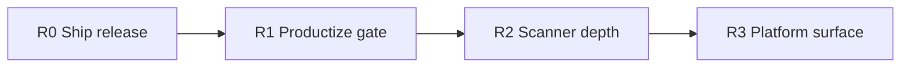

# SentinelFlow Roadmap

Post–audit baseline on `main`: multi-scanner gate is trustworthy for CI dogfood; **R0** (`v1.1.0` binaries) and **R1** (productize) are done. Next leverage is scanner depth (R2), then platform (R3).

---

## North star

One binary / one Action that teams trust to **fail builds on real risk** without false greens, silent skips, or install friction.

---

## Current baseline (done)

| Theme | Status |
| --- | --- |
| Engine correctness (findings-on-error, fail gates, exclude vs allowlist) | Done (Wave 1) |
| Delivery hardening (Action env binding, install checksums, pinned GoReleaser) | Done (Wave 2) |
| Scanner honesty / FN–FP hygiene (policy/IaC align, scoped skips, redact) | Done (Wave 3) |
| CI unit tests + configurable `scan_timeout` | Done (#13/#14) |
| First GitHub Release binaries (`v1.1.0`) | Done (Hub images pending secrets) |
| Install matrix decision (no `go install`) | Done (R1) |
| Action `timeout`, deps `fail_on_error`, CI docs (container/baseline/SARIF) | Done (R1) |

Residual detail: [audit-residual-risks.md](audit-residual-risks.md). Release steps: [releasing.md](releasing.md).

---

## R0 — Ship the product ✅

| Work | Status |
| --- | --- |
| Tag `v1.1.0` + binaries / checksums | Done |
| Release works without Docker Hub secrets (`--skip=docker`) | Done |
| Verify `install.sh` | Done (parse fix in #17) |
| Fold audit notes into CHANGELOG | Done |
| Docker Hub images | Blocked on secrets (optional) |

---

## R1 — Productize the gate ✅

| Work | Status |
| --- | --- |
| Stop implying `go install`; clear install matrix | Done |
| Action `timeout` → `--timeout` | Done |
| `scanners.dependencies.fail_on_error` (default strict) | Done |
| Container-in-CI path documented (`delivery=build` + Trivy) | Done |
| Baseline create/update + Action `use-baseline` docs | Done |
| SARIF upload `if: always()` snippet | Done |

---

## R2 — Scanner depth (quality over breadth)

**Goal:** Raise signal on surfaces users already enable; stay honest where incomplete.

**Quality waves (A–E)** — landed on `main` via quality-waves PR (finding IDs, parse/match, reliability, lockfile-first deps, license opt-in + docs honesty):

| Theme | Status |
| --- | --- |
| Finding-ID correctness | Done (package/container/col in IDs; report version from buildinfo) |
| Parse / match fixes | Done (`FROM --platform`, IPv6 SG, S3 literal bucket refs) |
| Reliability | Done (bad patterns.yaml fails; history truncation errors; count≠fake 0) |
| Lockfile-first deps | Done (npm lock + go.sum preferred) |
| License honesty | Done — limited map; **opt-in** only (not in `--all`) |

| Work | Why | Acceptance |
| --- | --- | --- |
| License default-on demotion (**chosen honesty path**) | Limited map = high FN | Docs + Action: license **opt-in** (not in `--all`); CLI alignment may land with quality-wave Go work |
| Dependencies: Ruby `Gemfile.lock` | Close claim gap | Done — RubyGems via `Gemfile.lock`; bare Gemfile stays unsupported |
| CloudFormation | Was listed as a planned gap | **Not planned** for now — unsupported; listing it fails validation |
| Policy ↔ IaC drift suite | Prevent silent divergence | Done for privileged pod/init + public/unencrypted S3 |
| Secrets: entropy/pattern tuning + more fixtures | Core value prop | Measured FP drop on demo + self-scan |
| ~~SAST: move intentional patterns out of production sources~~ | Done — `rules.yaml` + FP regex fixes | Patterns embedded from data file; SAST path excludes removed |
| SAST: taint/dataflow or richer sinks | Still line-local regex | Keep honest docs; expand rules carefully |
| Redact: structured secret fields, not only snippet heuristics | Defense in depth | Done for Title/Description/Snippet/Metadata/Remediation/References on secret findings |

**Defer unless pulled forward:** AI code review (keep rejected until a real design). CloudFormation (explicit non-goal near term).

---

## R3 — Platform surface

**Goal:** SentinelFlow as a small platform, not only a CLI.

| Work | Why | Acceptance |
| --- | --- | --- |
| OSV worker pool / rate limit / offline vulndb refresh | Scale + CI stability | Configurable concurrency; documented rate behavior |
| Findings identity + diff across runs | PR comments / trends | Stable IDs; optional “new vs baseline” summary |
| Multi-repo / monorepo path filters | Enterprise layouts | `include`/`exclude` with clear precedence docs |
| Plugin or custom rule packs (beyond Rego files) | Extensibility without forks | Documented extension point **or** “Rego-only” decision |
| Signed releases (cosign) + Action pin-by-digest docs | Supply chain story | Cosign verify in install notes |
| Performance budget on large repos | Real monorepos | Benchmark + documented guidance (concurrency, exclude) |
| Docker Hub publish once secrets exist | Completes advertised `delivery: docker` for external repos | Hub tags on next `v*` release |

---

## Explicit non-goals (near term)

- Rewriting the engine in another language
- Full cloud CSPM (AWS/GCP live APIs)
- Replacing Trivy with an in-house container CVE engine
- Marketplace “AI autofix” without a scoped design
- Advertising `go install` before a deliberate module/repo rename

---

## Suggested sequence

1. ~~**R0** — cut `v1.1.0`~~ done.
2. ~~**R1** — install decision + timeout / OSV flake / CI docs~~ done.
3. **R2** — quality waves (finding IDs, parse/match, no silent skips, lockfile-first deps, license opt-in); ~~SAST rules out of Go sources~~ done (partial); continue secrets/redact depth.
4. **R3** — platform, signing, monorepo, identity; Hub images when secrets land.

Re-run the [audit loop](audit-residual-risks.md) after each release train; keep residual risks short and current.

---

## Success metrics (per release train)

| Metric | Target |
| --- | --- |
| Self-scan (`scan --all --fail-on high`) | Exit 0 on `main` |
| Unit + script CI | Required checks green |
| Install path | `install.sh` verifies checksum against the new tag |
| Action dogfood | External-style `delivery: docker` works against the release image (when Hub published) |
| Honesty | No README/Action claim for unimplemented scanners |
