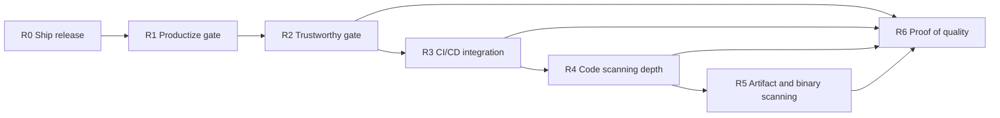

# SentinelFlow Roadmap

R0 (`v1.1.0` binaries) and R1 (productize the gate) shipped in v1.1.x. **R2–R6 shipped in v1.2.0**: a trustworthy CI gate, CI/CD integration, deeper code scanning, artifact scanning, and quality proofs. Next up: [v1.3.0 candidates](#v130-candidates). Native Go handles core checks; optional adapters wrap Semgrep, Syft/Grype, Trivy `fs`, gitleaks, and YARA when they are installed.

```mermaid
flowchart LR
  r0[R0 Ship release]
  r1[R1 Productize gate]
  r2[R2 Trustworthy gate]
  r3[R3 CI/CD integration]
  r4[R4 Code scanning depth]
  r5[R5 Artifact and binary scanning]
  r6[R6 Proof of quality]
  r0 --> r1 --> r2 --> r3 --> r4 --> r5
  r2 --> r6
  r3 --> r6
  r4 --> r6
  r5 --> r6
```

---

## North star

One binary / one Action that teams trust to **fail builds on real risk** without false greens, silent skips, or install friction.

---

## Current baseline (done)

| Theme | Status |
| --- | --- |
| Engine correctness (findings-on-error, fail gates, exclude vs allowlist) | Done (Wave 1) |
| Delivery hardening (Action env binding, install checksums, pinned GoReleaser) | Done (Wave 2) |
| Scanner honesty / FN–FP hygiene (policy/IaC align, scoped skips, redact) | Done (Wave 3) |
| CI unit tests + configurable `scan_timeout` | Done (#13/#14) |
| First GitHub Release binaries (`v1.1.0`) | Done (Hub images pending secrets) |
| Install matrix decision (no `go install`) | Done (R1) |
| Action `timeout`, deps `fail_on_error`, CI docs (container/baseline/SARIF) | Done (R1) |
| Quality waves A–E (IDs, parse/match, lockfile-first, license opt-in) | Done |

Residual detail: [audit-residual-risks.md](audit-residual-risks.md). Release steps: [releasing.md](releasing.md).

---

## R0 — Ship the product ✅

| Work | Status |
| --- | --- |
| Tag `v1.1.0` + binaries / checksums | Done |
| Release works without Docker Hub secrets (`--skip=docker`) | Done |
| Verify `install.sh` | Done (parse fix in #17) |
| Fold audit notes into CHANGELOG | Done |
| Docker Hub images | Blocked on secrets (optional) |

---

## R1 — Productize the gate ✅

| Work | Status |
| --- | --- |
| Stop implying `go install`; clear install matrix | Done |
| Action `timeout` → `--timeout` | Done |
| `scanners.dependencies.fail_on_error` (default strict) | Done |
| Container-in-CI path documented (`delivery=build` + Trivy) | Done |
| Baseline create/update + Action `use-baseline` docs | Done |
| SARIF upload `if: always()` snippet | Done |

---

## R2 — Make the gate trustworthy

**Goal:** CI can tell “found risk” from “tool broke”; suppressions survive code motion; reports are GitHub-code-scanning grade.

| Work | Why | Acceptance |
| --- | --- | --- |
| Distinct exit codes | One `1` hid timeouts vs findings vs crashes | `0` pass, `1` gate, `2` scanner/config error, `3` timeout. Documented in [usage.md](usage.md). |
| Line-independent fingerprints | Line/col in IDs re-opened baselined findings on every edit | `Finding.Fingerprint` from rule + relative path + snippet/value hash (no line numbers). Moving a finding one line does not change the fingerprint. |
| Baseline v2 | No reason/expiry; v1 hashes include lines | Version `2.0` matches fingerprints; `reason` + `expires`; still reads v1 files. |
| Inline suppressions | Only file-level baseline today | `sentinelflow:ignore <rule-id> -- reason` on the same line or the line above. Counts in reports. |
| Skip accounting | 5 MB / `dist/` / `build/` skips were silent | Oversized and unreadable files appear in `ScannerRun.Warnings` / `skipped`. `scanners.max_file_size` is configurable. |
| Git metadata | `refs/heads/` only — empty on detached HEAD (GitHub PRs) | `git rev-parse HEAD` / `--abbrev-ref`, then `GITHUB_SHA` / `GITHUB_HEAD_REF` / `CI_COMMIT_SHA`. |
| SARIF 2.1.0 completeness | GitHub code scanning ignored fingerprints and CWE | `partialFingerprints`, `security-severity`, CWE tags, `automationDetails.id`, `toolExecutionNotifications`, relative URIs + `originalUriBaseIds`. Schema-validated golden tests. |
| Noisy rules | `path-traversal` flagged every `../` import | Restricted to file-open sinks. Secrets deduped per value + location. |

**Success metrics:** fingerprint-stability unit test; self-scan still exit 0 on `main` with `--fail-on high`; SARIF golden test green.

---

## R3 — CI/CD integration

**Goal:** The Action works for **external** repos without Docker Hub, and scans only what changed when that is what the pipeline wants.

| Work | Why | Acceptance |
| --- | --- | --- |
| `--diff-base` / `--staged` | Full-tree scans and whole-tree pre-commit hooks | Findings limited to changed files/lines. Hook uses `--staged`. PR history scan is `base..head`. |
| `delivery: release` | Default `docker` + `:latest` is unpublished | Action downloads the release binary and verifies `checksums.txt`. Default image is a version tag. |
| SHA-pinned `uses:` | Mutable tags | Every third-party action pinned by commit SHA; Dependabot keeps them updated. |
| Job summary + extra formats | Operators need a glanceable CI surface | `$GITHUB_STEP_SUMMARY`, GitLab `gl-sast-report.json` / `gl-dependency-scanning-report.json`, JUnit XML, `--emit-annotations`. |
| Signed releases | Supply-chain story | Cosign keyless signatures on checksums, SLSA provenance, release SBOM. `install.sh` documents verify. |

**Success metrics:** `delivery: release` documented path works without Hub; Action dogfood writes a job summary.

---

## R4 — Code scanning depth

**Goal:** Raise signal on surfaces users already enable; stay honest where incomplete. Hybrid: native Go plus optional tools.

| Work | Why | Acceptance |
| --- | --- | --- |
| External adapter framework | Semgrep/Grype/gitleaks exist; wrapping beats rewriting | `internal/adapter/external` with `mode: auto\|required\|off`. Missing + `auto` → warning. Missing + `required` → error. |
| SAST rules.yaml v2 | Line-local regex, no languages/paths | Schema: `languages`, `paths`, `pattern-not`, `confidence`, `cwe`, `owasp`. Positive + negative fixtures per rule. |
| Native Go AST pass | Regex cannot see non-constant `exec.Command` / `sql.Query` args | `go/ast` sinks for command and SQL with non-constant arguments. |
| Semgrep adapter | Dataflow SAST | When `semgrep` is on PATH (or `mode: required`). |
| Secrets providers + gitleaks + `--verify-secrets` | Coverage gaps; live verify is opt-in | Additional providers; gitleaks adapter; `--verify-secrets` off by default (network). |
| OSV `querybatch` + retry + disk cache | Per-package `/v1/query`, no retry, memory-only cache | Batch queries, bounded workers, exponential backoff + `Retry-After`, on-disk cache. (Offline DB deferred: needs a local OSV range matcher.) |
| Go transitive deps | Only direct `go.mod` requires | `go.sum` / module graph entries queried; fixed versions reported. |
| Grype adapter | Depth beyond native parsers | Optional. |
| SBOM ingest + SPDX | Generate-only, 3 ecosystems, Cargo missing versions | `scan --sbom file.cdx.json`; Cargo versions; SPDX output. |

**Success metrics:** OSV batch used in unit tests; Go `go.sum` transitives appear as findings when mocked; SAST fixtures stay green.

---

## R5 — Artifact and binary scanning

**Goal:** Built outputs are inspected, not skipped. Native catalogers feed the shared OSV matcher; adapters fill ecosystem gaps.

| Work | Why | Acceptance |
| --- | --- | --- |
| Classifier (magic bytes) | Extension allowlists miss renamed binaries | ELF, PE, Mach-O, zip/jar/war/wheel, tar/gz, OCI / `docker save`. Also used by secrets to skip true binaries. |
| Safe unpacker | Zip-slip / zip bombs | Blocks path escape and symlink escape; limits depth, extracted bytes, compression ratio; honors scan deadline. |
| `Location.ArtifactPath` | Nested members have no location model | Nested paths like `app.war!/WEB-INF/lib/x.jar!/pom.properties`; SARIF logical locations. |
| Native catalogers | No binary SCA | Go `debug/buildinfo` (incl. outdated stdlib), JAR `pom.properties`, wheel METADATA, `package.json`, cargo-auditable, dpkg/apk status. All → OSV + SBOM. |
| Syft/Grype + Trivy `fs`/`rootfs` | rpm and image layouts | Adapters fill gaps. |
| Binary secrets | Strings in binaries were never scanned | Printable strings (min length) through existing secret matchers. |
| Hardening | No PIE/RELRO/NX/ASLR checks | ELF/PE/Mach-O via stdlib; medium/low by default. |
| Malware heuristics | Opt-in, scored | Built-in strings/hex, UPX/entropy, npm install scripts, typosquat, obfuscated JS; optional YARA adapter. |

Entry points: `scan --artifacts` (default globs `dist/**`, `build/**`, `*.jar`, `*.whl`, `*.tar*`, ELF/PE) and `sentinelflow scan-artifact <file|dir|image.tar>`. **Not** part of `--all`.

**Success metrics:** unpacker rejects zip-slip in tests; a Go binary with known modules produces component findings against a mock OSV; hardening flags a non-PIE test ELF.

---

## R6 — Proof of quality (runs alongside every phase)

| Work | Why | Acceptance |
| --- | --- | --- |
| Labeled benchmark corpus | Precision/recall is currently anecdotal | Secrets fixtures, OWASP-oriented subset, sample ELF/JAR/wheel. CI prints precision/recall per scanner. |
| Fuzz tests | Parsers are attack surface | Go fuzz for lockfiles, unpacker, ELF/PE. |
| Golden SARIF + schema | Regression-proof GitHub upload | Required in unit CI. |
| Performance budget | Real monorepos | Documented guidance + a budget check target. |
| Self-scan of release binaries | Dogfood artifacts | Release workflow runs `scan-artifact` on SentinelFlow binaries. |

---

## v1.3.0 candidates

From the v1.2.0 review. Ordered by impact on signal quality.

| Work | Why | Evidence (v1.2.0) |
| --- | --- | --- |
| SSA taint for SQL, path, and SSRF sinks; more sources (`r.URL.Query()`, body, headers, `PathValue`, gin/echo/chi) | Only shell exec has taint; other sinks are line-local regex keyed on variable names | `internal/scanner/sast/goast_ssa.go` |
| Grow the labeled corpus | precision/recall = 1.00 over 3 labels in 2 scanners is not a signal | `internal/quality`; 8 of 10 regex rules unlabeled; no IaC/policy/deps corpus |
| Scope regex SAST rules by `languages:` | 9 of 10 rules run on every language | `rules.yaml` |
| Coverage on security boundaries | `unpack` 47%, `artifacts` 14%, `adapter` 6%, `cli` 28% | `go test -cover ./...` |
| OPA `opa/v1/rego` migration | `opa/rego` v0 wrapper is deprecated (SA1019) | `internal/scanner/policy/engine.go`, `policies/*.rego` |
| Perf budget with SAST on | Current budget times secrets only; SSA loads packages | `TestPerfBudgetSmallTree` |
| Go-aware binary hardening | Canary/FORTIFY/RELRO checks are C-oriented and flag every static Go binary | `scan-artifact` on SentinelFlow itself |
| Offline OSV DB | Air-gapped CI; needs a local range matcher per ecosystem | `db update` removed in v1.2.0 |
| Merge `scan_git_history` / `git.scan_history` | Two keys, one feature | `docs/usage.md` |

---

## Explicit non-goals (near term)

- Rewriting the engine in another language
- Full cloud CSPM (AWS/GCP live APIs)
- Replacing Trivy/OSV with an in-house container CVE database
- Dynamic sandbox detonation / malware execution
- Marketplace “AI autofix” without a scoped design
- Advertising `go install` before a deliberate module/repo rename

---

## Suggested sequence

1. ~~**R0** — cut `v1.1.0`~~ done.
2. ~~**R1** — install decision + timeout / OSV flake / CI docs~~ done.
3. ~~**R2–R6**~~ shipped in v1.2.0.
4. **v1.3.0** — see [candidates](#v130-candidates).

Re-run the [audit loop](audit-residual-risks.md) after each release train; keep residual risks short and current.

---

## Success metrics (per release train)

| Metric | Target |
| --- | --- |
| Self-scan (`scan --all --fail-on high`) | Exit 0 on `main` |
| Gate vs error | Findings use exit `1`; scanner/config errors use exit `2`; timeout uses exit `3` |
| Unit + script CI | Required checks green |
| Fingerprints | Moving a finding one line does not reopen a v2 baseline |
| Install path | `install.sh` verifies checksum against the new tag |
| Action dogfood | `delivery: release` works for external-style installs; `delivery: docker` when Hub is published |
| Honesty | No README/Action claim for unimplemented scanners |
